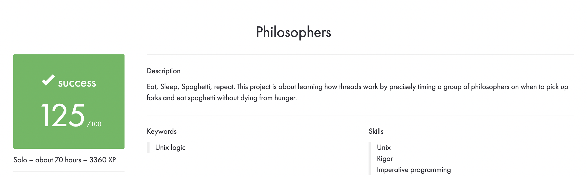

# 42-Philosophers
In this project, you will learn the basics of threading a process. You will see how to create threads and you will discover mutexes.

## Subject
**The assignment is here!** [(link)](https://github.com/AtaullinShamil/42-Philosophers/blob/main/includes/Philosophers_subject.pdf)
